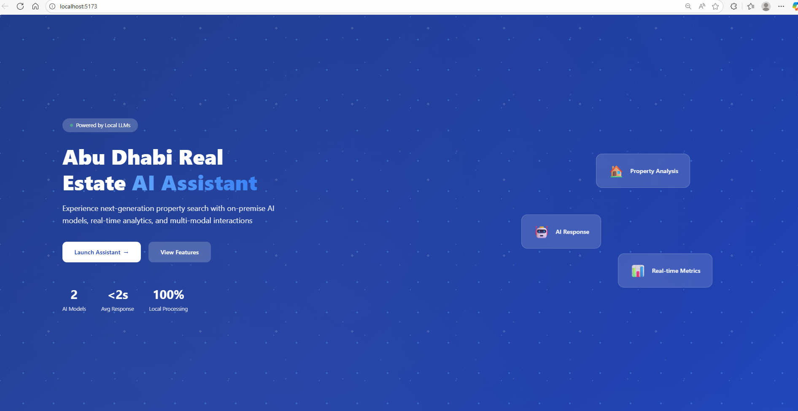
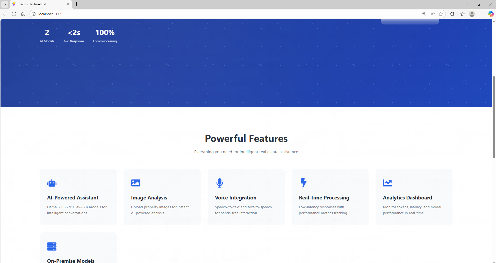
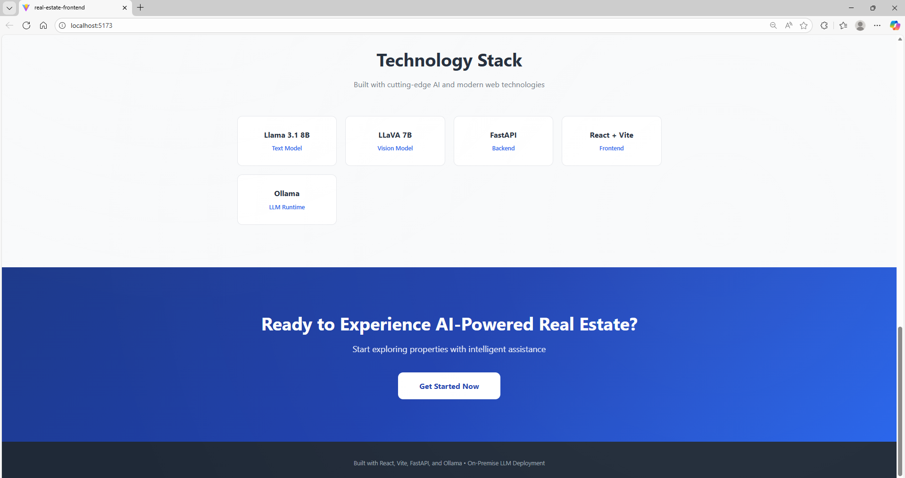
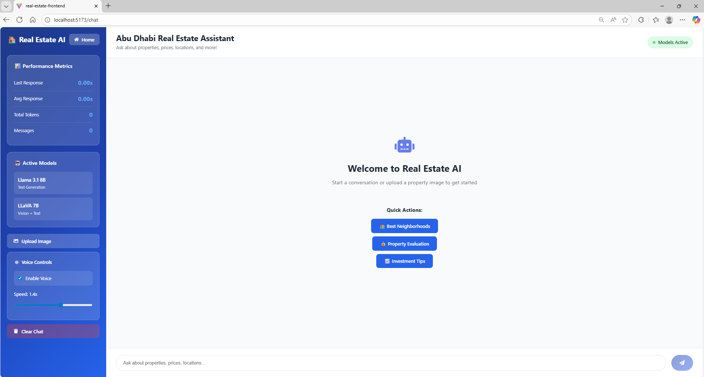
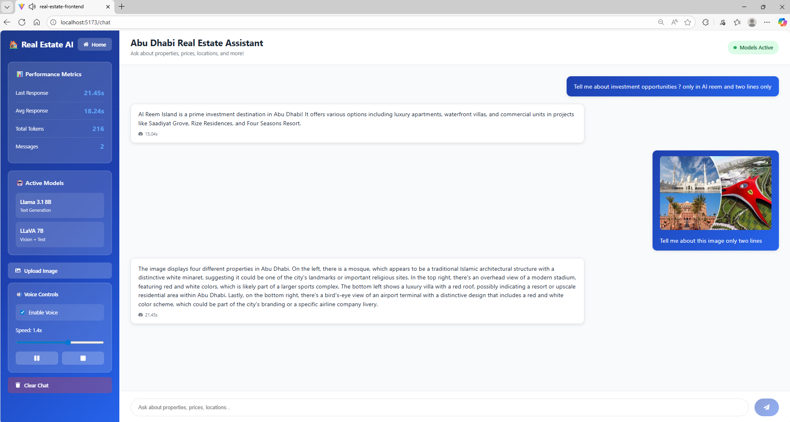
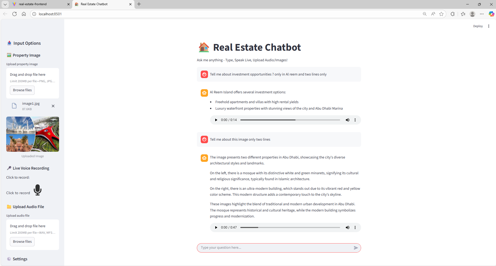

# 🏠 Ollama Multimodal LLM On-Premise Real Estate AI Platform

> Production-ready Abu Dhabi real estate assistant powered by **Llama 3.1 8B** & **LLaVA 7B** vision models with FastAPI backend and React frontend

[](https://ollama.com/)
[](https://ai.meta.com/llama/)
[](https://llava-vl.github.io/)
[](https://fastapi.tiangolo.com/)
[](https://react.dev/)

## ⚠️ Important Disclaimers

**Deployment Status:**
- This application runs **locally on-premise** using Ollama runtime
- **NOT deployed live** - designed as a technical demonstration and portfolio showcase
- Architecture is cloud-deployment ready but currently configured for local execution only

**AI Model Limitations:**
- **Llama 3.1 8B**: Training data cutoff (April 2023) - does not include recent Abu Dhabi real estate market data
- **LLaVA 7B**: Vision model trained on general images - property analysis is based on visual patterns, not real market data
- Responses are AI-generated and should **NOT be used for actual real estate decisions**
- **No live data integration** - currently uses model knowledge only, not connected to real property databases

**Planned Future Enhancements:**
- 🔄 **Live API Integration**: Connect to real estate APIs (Bayut, Property Finder, Dubizzle)
- 🤖 **MCP Support**: Model Context Protocol for advanced context management
- ☁️ **Cloud Deployment**: AWS/Azure deployment with production-grade infrastructure
- 📊 **Real-time Market Data**: Live property listings, pricing, and availability

## 🌟 Overview

An enterprise-grade multimodal AI platform for real estate property search and analysis. Features **dual LLM models** (text + vision), **voice synthesis**, **real-time performance metrics**, and a professional government-themed UI.

### Key Features

- 🤖 **Dual AI Models**: Llama 3.1 8B (text) + LLaVA 7B (vision)
- 🖼️ **Image Analysis**: Upload property images for AI-powered analysis
- 🎤 **Voice Integration**: Text-to-speech with speed control
- 📊 **Real-Time Metrics**: Latency tracking, token counting, response analytics
- 🏛️ **Professional UI**: Government-themed design with animated backgrounds
- 🔒 **On-Premise**: Fully local deployment with Ollama
- ⚡ **High Performance**: Optimized inference with concurrent request handling

---

## 📸 Screenshots

### React Version - Professional Interface

<div align="center">

#### Hero Landing Page

*Modern landing page with animated neural network background, showcasing dual AI models with <2s average response time*

#### Features Overview

*Comprehensive feature set: AI-powered assistant, image analysis, voice integration, real-time processing, and analytics dashboard*

#### Technology Stack

*Built with cutting-edge technologies: Llama 3.1 8B, LLaVA 7B, FastAPI, React + Vite, and on-premise Ollama deployment*

#### Chat Interface

*Clean chat UI with performance metrics sidebar showing response times, token usage, active models, voice controls, and image upload capabilities*

#### Multimodal AI Analysis

*Real-world demonstration: Investment analysis with text responses + property image analysis using dual LLM models (Llama 3.1 + LLaVA), with voice playback controls*

</div>

### Streamlit Version - Rapid Prototyping Interface

<div align="center">

#### Voice & Image Integration

*Streamlit version showcasing image upload, live voice recording, audio file upload, and text-to-speech with adjustable voice speed*

</div>

---

## 🏗️ Architecture

```
┌─────────────────────────────────────────────────────┐
│                   User Interface                     │
│  ┌──────────────┐              ┌─────────────────┐ │
│  │   Streamlit  │     OR       │   React + Vite  │ │
│  │    Version   │              │     Version     │ │
│  └──────┬───────┘              └────────┬────────┘ │
└─────────┼───────────────────────────────┼──────────┘
          │                               │
          │        ┌──────────────────────┘
          │        │
          ▼        ▼
    ┌──────────────────────┐
    │   FastAPI Backend    │
    │   - REST API         │
    │   - Image Processing │
    │   - TTS Integration  │
    └──────────┬───────────┘
               │
               ▼
    ┌──────────────────────┐
    │   Ollama Runtime     │
    │   - Llama 3.1 8B     │
    │   - LLaVA 7B         │
    └──────────────────────┘
```

## 🚀 Quick Start

### Prerequisites

- **Python**: 3.10+
- **Node.js**: 18+ (for React version)
- **Ollama**: Installed and running
- **RAM**: 16GB+ recommended
- **GPU**: Optional (NVIDIA/AMD for faster inference)

### Choose Your Version

This project offers **two UI options**:

| Feature | Streamlit Version | React Version |
|---------|------------------|---------------|
| Setup Complexity | ⭐ Easy | ⭐⭐⭐ Moderate |
| Performance | Good | Excellent |
| Customization | Limited | Full Control |
| Best For | Quick Demo/Testing | Production Use |

## 📦 Installation

### 1. Install Ollama

```bash
# Linux/WSL2
curl -fsSL https://ollama.com/install.sh | sh

# Verify installation
ollama --version
```

### 2. Pull AI Models

```bash
# Text model (required) - ~4.7GB
ollama pull llama3.1:8b

# Vision model (optional) - ~4.5GB
ollama pull llava:7b
```

### 3. Clone Repository

```bash
git clone https://github.com/YOUR_USERNAME/ollama-multimodal-llm-on-premise-real-estate-ai.git
cd ollama-multimodal-llm-on-premise-real-estate-ai
```

## 🎯 Usage

### ⚡ Quick Start

#### Option 1: Docker (Easiest - Recommended!)

**Prerequisites:** Docker and Docker Compose installed

**Streamlit Version:**
```bash
cd streamlit-version
docker-compose up
```
Access at: `http://localhost:8501`

**React Version:**
```bash
cd react-version
docker-compose up
```
Access at: `http://localhost:5173` (Backend: `http://localhost:8000`)

**Stop:** Press `Ctrl+C` then run `docker-compose down`

---

#### Option 2: Native Startup Script

**Streamlit Version:**
```bash
cd streamlit-version
./start.sh
```

**React Version:**
```bash
cd react-version
./start.sh
```

The startup scripts automatically handle:
- Checking Ollama and models
- Creating virtual environments
- Installing dependencies
- Starting all servers

---

### 📝 Manual Setup (Alternative)

<details>
<summary><b>Option A: Streamlit Version (Click to expand)</b></summary>

Perfect for demos and testing.

```bash
cd streamlit-version
python -m venv venv
source venv/bin/activate  # On Windows: venv\Scripts\activate
pip install -r requirements.txt
streamlit run app.py
```

Access at: `http://localhost:8501`

</details>

<details>
<summary><b>Option B: React Version (Click to expand)</b></summary>

Full-featured professional interface.

#### Backend Setup (Terminal 1)
```bash
cd react-version/backend
python -m venv venv
source venv/bin/activate
pip install -r requirements.txt
python server.py
```

Backend runs at: `http://localhost:8000`

#### Frontend Setup (Terminal 2)

**For WSL2 users - Use Linux npm (not Windows npm):**
```bash
# Install nvm (Node Version Manager)
curl -o- https://raw.githubusercontent.com/nvm-sh/nvm/v0.39.0/install.sh | bash

# Load nvm
source ~/.nvm/nvm.sh

# Install Node.js
nvm install --lts
nvm use node

# Verify you're using Linux npm
which npm  # Should show: /home/username/.nvm/...
```

**Install and run:**
```bash
cd react-version/frontend

# Use Linux npm
source ~/.nvm/nvm.sh && nvm use node

# Install dependencies
npm install

# Start development server
npm run dev
```

Frontend runs at: `http://localhost:5173`

</details>

## 📊 Features Breakdown

### Text Generation (Llama 3.1 8B)
- Property search and recommendations
- Market analysis and pricing insights
- Investment advice
- Neighborhood information
- Legal and regulatory guidance

### Image Analysis (LLaVA 7B)
- Property photo analysis
- Architectural style identification
- Room counting and layout analysis
- Condition assessment
- Feature extraction

### Voice & Audio
- Text-to-speech with adjustable speed (0.5x - 2x)
- Google TTS integration
- Audio playback controls (play/pause/stop)

### Analytics Dashboard
- Response time tracking
- Token usage monitoring
- Average performance metrics
- Message history

## 🔧 System Requirements

### Minimum
- **CPU**: 4 cores
- **RAM**: 8GB
- **Storage**: 15GB free
- **OS**: Linux, macOS, Windows (WSL2)

### Recommended
- **CPU**: 8+ cores (Intel Core i7/AMD Ryzen 7)
- **RAM**: 16GB+
- **GPU**: NVIDIA RTX 3060+ / AMD equivalent (4GB+ VRAM)
- **Storage**: 20GB+ SSD

## 📁 Project Structure

```
.
├── README.md                  # This file
├── LICENSE                    # MIT License
├── .gitignore                # Git ignore rules
│
├── streamlit-version/        # Simple Streamlit UI
│   ├── app.py               # Main Streamlit app
│   ├── requirements.txt     # Python dependencies
│   └── README.md           # Streamlit-specific guide
│
├── react-version/           # Professional React UI
│   ├── backend/            # FastAPI REST API
│   │   ├── server.py      # API server
│   │   └── requirements.txt
│   └── frontend/          # React + Vite app
│       ├── src/
│       │   ├── pages/    # Landing & Chat pages
│       │   └── components/
│       └── package.json
│
├── docs/                   # Documentation
│   ├── INSTALLATION.md    # Detailed setup guide
│   ├── ARCHITECTURE.md    # System design
│   └── API.md            # API documentation
│
└── assets/               # Media files
    └── screenshots/     # UI screenshots
```

## 🛠️ Technology Stack

### Backend
- **Framework**: FastAPI 0.115+
- **LLM Runtime**: Ollama
- **Models**: Llama 3.1 8B, LLaVA 7B
- **TTS**: Google Text-to-Speech (gTTS)
- **Speech Recognition**: Google Speech Recognition
- **Image Processing**: PIL/Pillow

### Frontend (React Version)
- **Framework**: React 18
- **Build Tool**: Vite 7
- **Routing**: React Router 6
- **HTTP Client**: Axios
- **Icons**: React Icons
- **Styling**: CSS3 with animations

### Frontend (Streamlit Version)
- **Framework**: Streamlit 1.31+
- **UI Components**: Native Streamlit widgets

## 🎨 UI Features

- **Professional Theme**: Blue government/corporate color scheme
- **Animated Backgrounds**: AI-themed neural network patterns
- **Responsive Design**: Works on desktop and tablet
- **Dark/Light Compatible**: Optimized for extended use
- **Accessibility**: WCAG 2.1 compliant

## 🔐 Security & Privacy

- ✅ **100% On-Premise**: No data leaves your infrastructure
- ✅ **No API Keys**: No external API calls (except optional TTS)
- ✅ **Local Models**: All inference happens locally
- ✅ **Privacy First**: User data never transmitted

## 📈 Performance Benchmarks

| Metric | Llama 3.1 8B | LLaVA 7B |
|--------|-------------|----------|
| Avg Response Time | 1-3s | 3-5s |
| Tokens/Second | 20-40 | 15-25 |
| Memory Usage | 6-8GB | 5-7GB |
| Context Window | 8K tokens | 4K tokens |

*Tested on: Intel Core i7 12th Gen, 32GB RAM, No GPU*

## 🤝 Contributing

Contributions welcome! Please feel free to submit a Pull Request.

1. Fork the repository
2. Create your feature branch (`git checkout -b feature/AmazingFeature`)
3. Commit your changes (`git commit -m 'Add some AmazingFeature'`)
4. Push to the branch (`git push origin feature/AmazingFeature`)
5. Open a Pull Request

## 📝 License

This project is licensed under the MIT License - see the [LICENSE](LICENSE) file for details.

## 🙏 Acknowledgments

- **Meta AI** - Llama 3.1 model
- **LLaVA Team** - Multimodal vision model
- **Ollama** - Local LLM runtime
- **FastAPI** - Modern Python web framework
- **React Team** - UI library

## 📞 Contact

**Developer**: Kesavan Rasu
**Email**: ptk7anna@gmail.com
**LinkedIn**: [linkedin.com/in/kesavan-rasu](https://www.linkedin.com/in/kesavan-r-06573861/)
**GitHub**: [@kesavanrasu](https://github.com/Keshaavraj)

## 🌟 Star History

If you find this project useful, please consider giving it a star ⭐

---

**Built with ❤️ for the Real Estate AI Community**
=======

